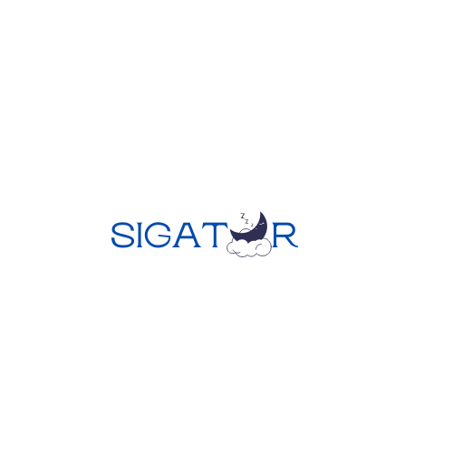

# SIGATUR — Sistem Pakar Diagnosa Penyakit Gangguan Tidur

<p align="center">
  
</p>

<p align="center">
  
  
  
  
  
</p>

---

## 📖 Tentang Aplikasi

**SIGATUR** adalah sistem pakar berbasis web yang dirancang untuk membantu mendiagnosa penyakit gangguan tidur menggunakan metode **Certainty Factor (CF)**. Sistem ini memungkinkan pengguna menjawab serangkaian pertanyaan terkait gejala yang dialami, kemudian sistem akan menghitung tingkat keyakinan terhadap setiap kemungkinan penyakit dan memberikan hasil diagnosa beserta solusi penanganannya.

---

## ✨ Fitur Utama

- 🔐 **Autentikasi** — Login, Register, dan manajemen sesi yang aman
- 🩺 **Diagnosa Interaktif** — Form diagnosa bertahap dengan indikator progress
- 📊 **Hasil CF** — Perhitungan Certainty Factor yang akurat dan transparan
- 📋 **Riwayat Diagnosa** — Histori lengkap setiap sesi diagnosa pengguna
- 📄 **Ekspor PDF** — Cetak laporan hasil diagnosa dengan kop surat
- 👤 **Manajemen Profil** — Edit profil dengan preview foto langsung
- 🛠️ **Panel Admin** — Kelola data penyakit, gejala, pertanyaan, solusi, aturan CF, dan pengguna
- 📈 **Dashboard Statistik** — Grafik bar dan donut diagnosa per penyakit

---

## 🧠 Metode Certainty Factor

Sistem menggunakan rumus CF standar Shortliffe & Buchanan:

```
CF_gejala  = CF_pakar × CF_user

CF_combine = CF_lama + (CF_baru × (1 - CF_lama))
```

**Skala keyakinan pengguna:**

| Pilihan | Nilai CF |
|---------|----------|
| Sangat Tidak Yakin | 0.0 |
| Tidak Yakin | 0.2 |
| Kurang Yakin | 0.4 |
| Cukup Yakin | 0.6 |
| Yakin | 0.8 |
| Sangat Yakin | 1.0 |

---

## 🛠️ Teknologi

| Komponen | Teknologi |
|----------|-----------|
| Backend | Laravel 8 |
| Frontend | Bootstrap 4, Blade Template |
| Database | MySQL |
| PDF | barryvdh/laravel-dompdf |
| Permission | spatie/laravel-permission |
| Chart | Chart.js |
| Alert | SweetAlert2 |

---

## ⚙️ Instalasi

### Prasyarat
- PHP >= 8.0
- Composer
- MySQL
- Node.js & NPM

### Langkah Instalasi

**1. Clone repository**
```bash
git clone https://github.com/MFahreza27/Gangguan-Tidur.git
cd Gangguan-Tidur
```

**2. Install dependencies PHP**
```bash
composer install
```

**3. Install dependencies Node**
```bash
npm install
```

**4. Salin file environment**
```bash
cp .env.example .env
```

**5. Generate application key**
```bash
php artisan key:generate
```

**6. Konfigurasi database**

Edit file `.env` sesuaikan dengan konfigurasi database lokal Anda:
```env
DB_CONNECTION=mysql
DB_HOST=127.0.0.1
DB_PORT=3306
DB_DATABASE=sigatur
DB_USERNAME=root
DB_PASSWORD=
```

**7. Jalankan migrasi dan seeder**
```bash
php artisan migrate
php artisan db:seed
```

**8. Buat symbolic link storage**
```bash
php artisan storage:link
```

**9. Build assets**
```bash
npm run dev
```

**10. Jalankan server**
```bash
php artisan serve
```

Akses aplikasi di: **http://localhost:8000**

---

## 👥 Akun Default

Setelah menjalankan seeder, akun berikut tersedia:

| Role | Email | Password |
|------|-------|----------|
| Admin | admin@sigatur.com | password |
| User | user@sigatur.com | password |

> ⚠️ Segera ganti password setelah login pertama kali.

---

## 📁 Struktur Direktori Penting

```
sigatur/
├── app/
│   ├── Http/Controllers/
│   │   ├── DiagnosaController.php   # Logika CF utama
│   │   ├── AturanController.php     # Manajemen aturan CF pakar
│   │   └── RiwayatController.php    # Riwayat & ekspor PDF
│   └── Models/
│       ├── Aturan.php               # Model aturan CF
│       ├── Gejala.php               # Model gejala
│       ├── Penyakit.php             # Model penyakit
│       └── Pasien.php               # Model riwayat diagnosa
├── resources/views/
│   ├── admin/                       # View panel admin
│   ├── auth/                        # Login & register
│   ├── pdf/                         # Template PDF
│   ├── diagnosa.blade.php           # Form diagnosa
│   └── riwayat.blade.php            # Halaman riwayat
└── routes/
    └── web.php                      # Definisi route
```

---

## 🔒 Keamanan

- CSRF protection pada semua form
- Session regeneration setelah login (mencegah session fixation)
- Role-based access control menggunakan Spatie Permission
- Ownership check pada akses PDF (mencegah IDOR)
- Route riwayat dan PDF dilindungi middleware `auth`
- Role user di-hardcode saat register (tidak bisa dimanipulasi)

---

## 📸 Screenshot

| Halaman | Deskripsi |
|---------|-----------|
| Login | Halaman autentikasi dengan toggle password |
| Dashboard Admin | Statistik data + grafik diagnosa |
| Dashboard User | Shortcut diagnosa & riwayat |
| Form Diagnosa | Pertanyaan bertahap dengan progress bar |
| Riwayat | Hasil CF dengan visualisasi bar |
| PDF | Laporan diagnosa dengan kop surat |

---

## 📄 Lisensi

Proyek ini dibuat untuk keperluan akademik. Silakan gunakan dan modifikasi sesuai kebutuhan.

---

## 👨‍💻 Developer

**M. Fahreza** — [@MFahreza27](https://github.com/MFahreza27)
